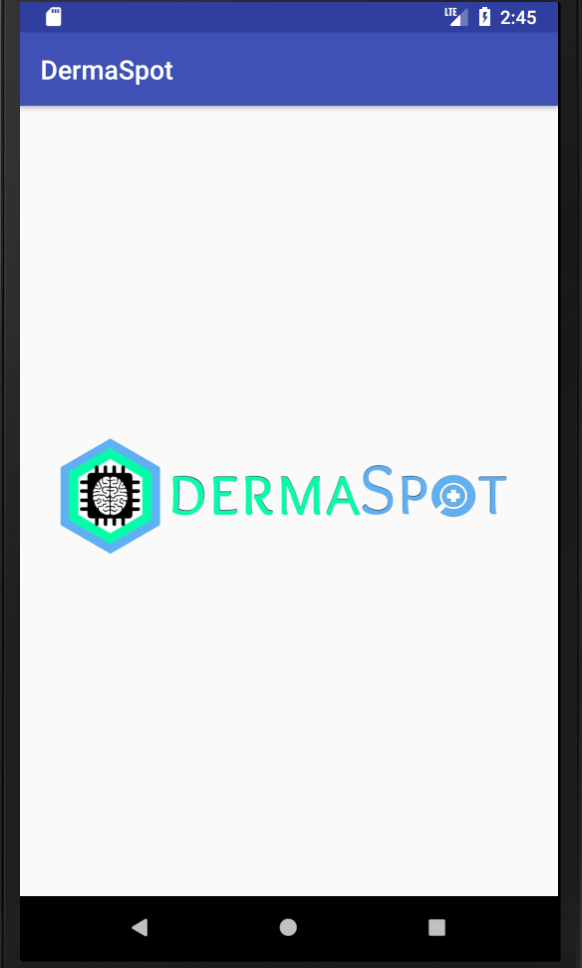
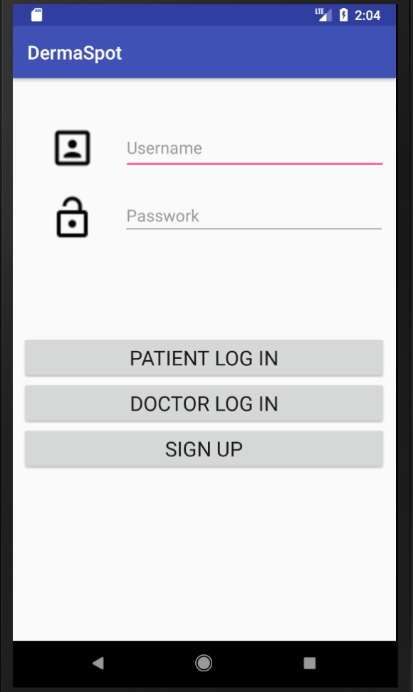
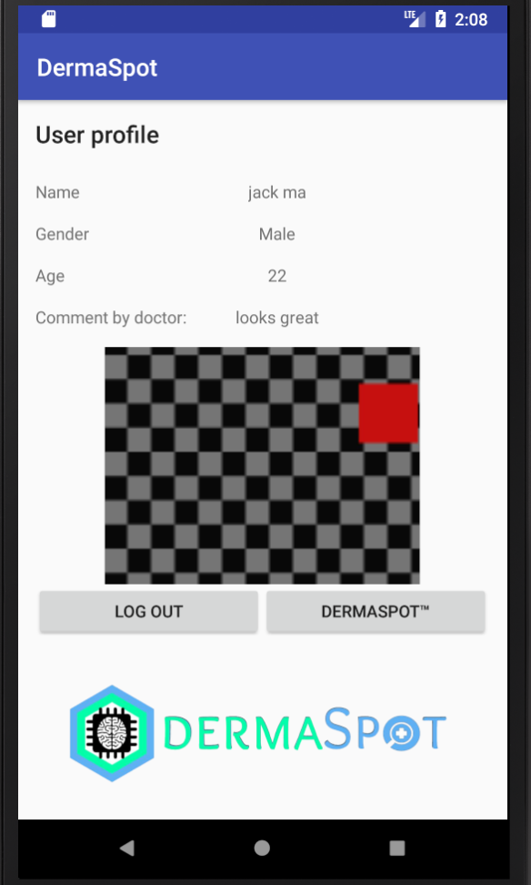
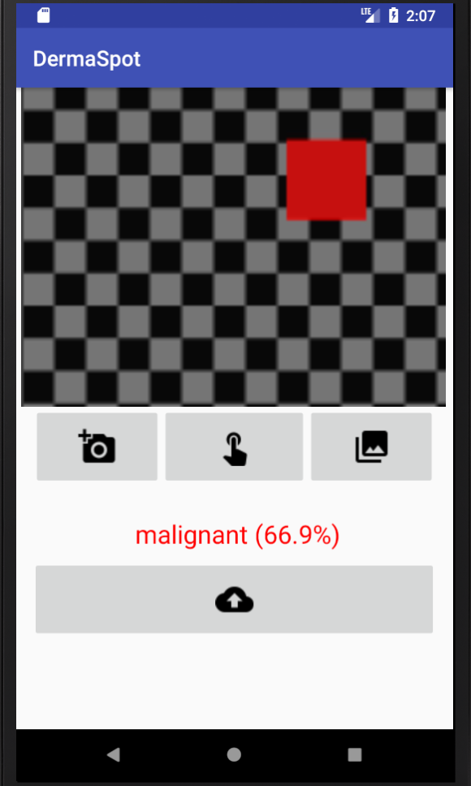
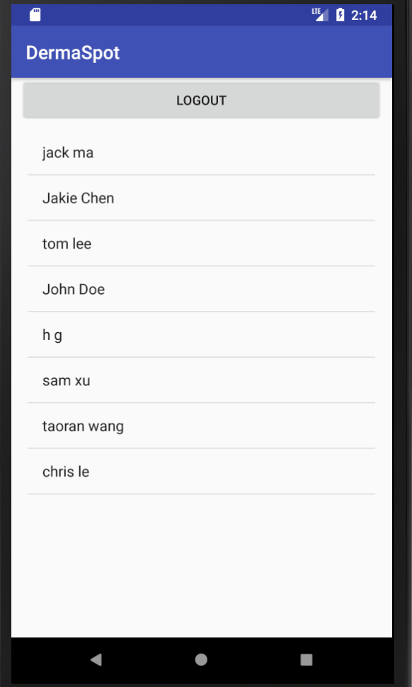
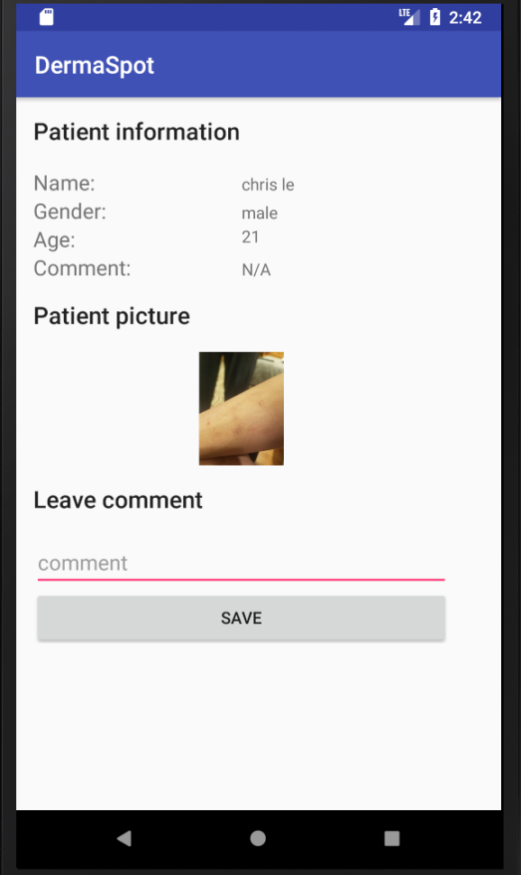

# DermaSpot
## Deep learning assisted skin diseases detection App
This app is developed for UConn Graduate Level Course BME6086: Dev of Mobile Apps for Healthcare. @tracyghz wrote most of the Java
code for this project, while @Berlingrad and his partner Chris trained the CNN model. 

It enables patients to sign up, build their profile, taking pictures of their skin and upload them to the cloud for a doctor to review. Patients can also use this app
to self evaluate the chances of them getting skin cancer with the help of deep learning model (a convolutional neural network trained with
skin cancer dataset). Doctors are able to log in and leave comments according to the pictures uploaded by patients.

This app (DermaSpot) uses AWS Parse server, a cloud based MongoDB (https://aws.amazon.com/marketplace/pp/B01BLQ17TO), as its backend database servre. All it's data are stored in cloud. If you need to replicate this work,
make sure to have your own Parse server running. Parse docs could be found here http://docs.parseplatform.org/.

## Screen shots of DermaSpot illustraing some main functions

### Loading screen

### Login page

### User profile
 

### Deep learning suggestion
 

### Patient list (Doctor's account) 
 
 
### Patient information (Doctor's account)
 

